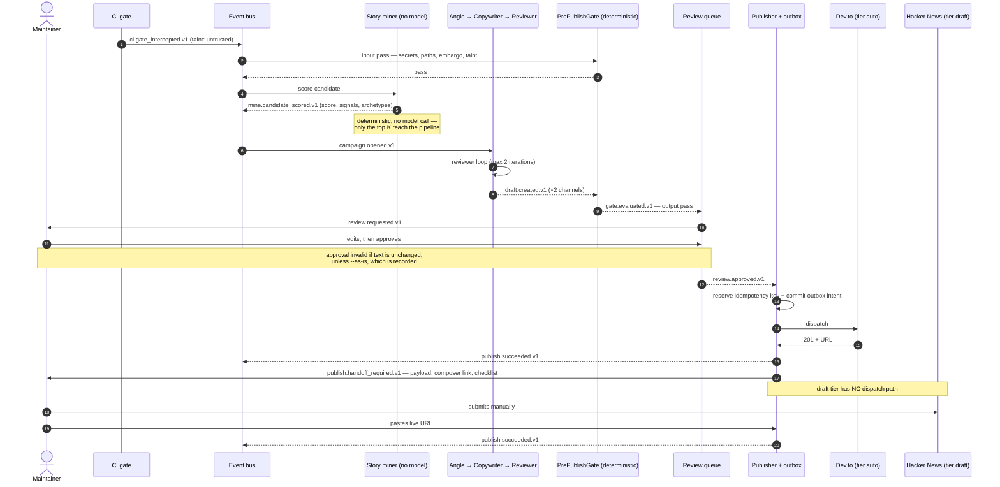

# EADROS Sequence Diagrams

Both diagrams are the runtime view of [`STATE_MACHINE.md`](STATE_MACHINE.md); where they disagree,
the state machine is authoritative.

## 1. Gate intercept → published, across two tiers

The normal path, and the one that shows why the tier model exists: the same approved story reaches
one channel automatically and another through a human.



Three things the earlier version of this diagram omitted, each of which changes what the system is:
the **Reviewer** and the **gate** both run before a human ever sees a draft; the **approval is only
valid if the maintainer edited something**; and the `draft`-tier channel is fully tracked despite
never being automated.

## 2. Wrong post → retraction

The path nobody diagrams and everybody eventually walks.

```mermaid
sequenceDiagram
    autonumber
    actor Dev as Maintainer
    participant CLI as /eadros retract
    participant Store as SQLite store
    participant A as Dev.to (delete: edit-only)
    participant B as Hacker News (delete: unsupported)

    Dev->>CLI: retract --id p-42 --class leak
    CLI->>Store: /eadros pause — block every dispatch first
    Note over CLI,Store: a leak usually means the gate missed a class;<br/>the queue behind it may carry more
    CLI->>Store: read posts, tier_at_publish, channel api.delete
    CLI-->>Dev: plan per channel — including what cannot be undone
    Dev->>CLI: confirm
    CLI->>A: unpublish + correct in place
    A-->>CLI: ok
    CLI->>B: (no delete endpoint exists)
    CLI-->>Dev: removal impossible here — draft a correction comment<br/>and fix the artifact the post pointed at
    CLI->>Store: post.retracted.v1 + gate_verdict_id that PASSED this content
    Note over Store: the verdict becomes a test case in /eadros eval —<br/>the only way the gate improves from being wrong
    Dev->>CLI: /eadros resume (kill-switch owner only)
    CLI->>Store: re-gate the paused queue under the updated rules
```

The asymmetry is the point: on one channel the mistake is undone in seconds, on the other it is
permanent. Knowing which is which **before** publishing is what `api.delete` is for
([ADR-0011](../adr/ADR-0011-channel-capability-tiers.md)), and it is why the gate is strictest on
channels where retraction does not exist.
