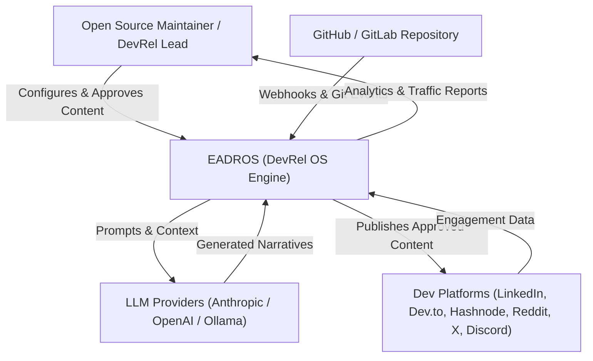

# EADROS Architecture: System Context (C4 Level 1)

## System Boundaries
* **Input Boundary:** Ingests Git logs, Webhooks, GitHub REST/GraphQL API, and Markdown documentation.
* **Processing Boundary:** Event Bus, Agent Orchestrator, LLM Provider Abstraction, Vector KB.
* **Output Boundary:** Human Review CLI/Dashboard, Publisher Adapters (LinkedIn, Dev.to, Hashnode, Reddit, X, Discord).
